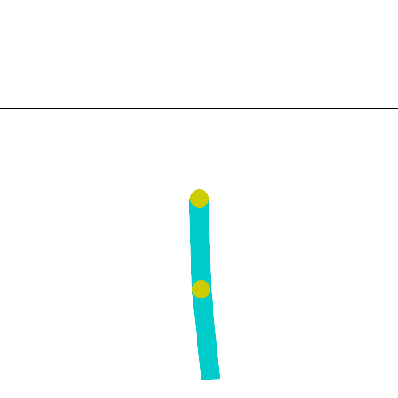

# Deep Q-Learning on Acrobot (Gymnasium)

Practice notebook for Deep Q-Networks (DQN). A neural network learns to swing a two-link
pendulum (the Acrobot) above a target line in as few steps as possible.



## Concepts covered
- Q-Network that approximates Q(s, a) for a continuous state space
- Target network with a soft update: w- <- tau * w + (1 - tau) * w-
- Experience replay (random mini-batches from a `deque` buffer)
- Epsilon-greedy exploration with decay
- Bellman targets with the `(1 - done)` trick for batches
- Custom TensorFlow training loop with `tf.GradientTape` and `@tf.function`
- Correct handling of `terminated` vs `truncated` in Gymnasium

## Results
| Agent | Mean reward over 20 episodes |
|---|---|
| Random | about -499 (always hits the 500 step limit) |
| Trained DQN (greedy) | about -90 (reaches the goal in roughly 90 steps) |

The environment was solved in 228 episodes (about 3 minutes on a CPU).

## Run it
```bash
pip install -r requirements.txt
jupyter notebook acrobot_dqn.ipynb
```
The notebook is self-contained (no extra helper files). It also runs on Google Colab.
